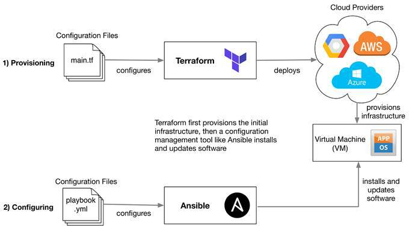

# Infrastructure as Code with Terraform
## What is Terraform
### Terraform Architecture 
#### Terraform default file/folder structure
##### .gitignore
###### AWS Keys with Terraform security

### Configuring VSCode Extensions for ease of use

Install the following extensions on VSCode:

- _HashiCorp Terraform_: Syntax highlighting and autocompletion for Terraform
- _Terraform Autocomplete_: Autocomplete for AWS resources with terraform
- _Terraform doc snippets_: Terraform code snippets (>8000) pulled from example...

### Terraform Commands
- `terraform init` to initialise terraform
- `terraform plan` reads your script and checks it. Similar to ansible `--check`
- `terraform apply` to run the playbook/implement the script
- `terraform destroy` to delete everything
- `terraform` for a full list of terraform commands

### Terraform file/folder structure
- `.tf` extension - `main.tf` is your 'runner' file; the file that executes everything
- Apply 'DRY' - 'Don't repeat yourself'

### Setting up AWS keys as an env in Windows Machine
- `AWS_ACCESS_KEY_ID` for aws access key variable
- `AWS_SECRET_ACCESS_KEY` for aws secret key variable
- Windows key > search `env` > click 'Environment Variables...' > enter the AWS Key variables into 'User variables" so it's specific to this user and not the entire system. Follow specific AWS key syntax - case sensitive. 